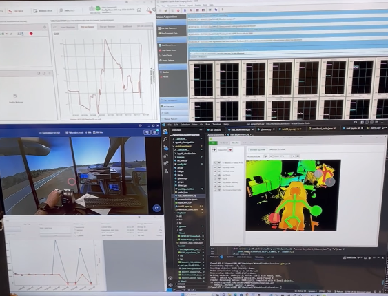

I am a graduate research assistant at Carnegie Mellon University (CMU). My work and interests primarily focus on multimodal machine learning, self-suprevised learning, on-device machine learning, and model compression for optimizaition and improved efficiency. In general, my interests revolve around the real-world applications of AI/ML in various fields.
  
<h1>Interests</h1>
<table style="border: none; border-collapse: collapse;">
  <tr>
    <td style="padding: 10px; border: none;">
      

        
      

    </td>
  </tr>
  <tr>
    <td style="padding: 10px; border: none; vertical-align: top; font-size: 18px;">
      <b>I primarily focus on using machine learning models as statistical predictors in various fields (e.g., aviation, autonomous driving, robotics, and human factors).</b> My recent research and projects have been concentrating on multomodal machine learning and Retrieval Augmented Generation (RAG). I suggest you explore my projects featured on <a href="https://sjhpark.github.io/projects/">Projects</a> page.
    </td>
  </tr>
</table>

