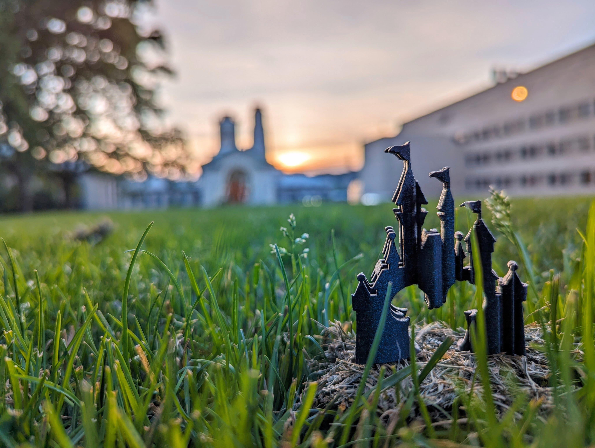

<!-- ---
permalink: /
title: "Welcome!"
author_profile: true
redirect_from: 
  - /about/
  - /about.html
---

I'm Ishan Mamadapur, a graduate student at Carnegie Mellon University pursuing my MS in Mechanical Engineering with a focus on Artificial Intelligence research. My journey combines hands-on experience in robotics and deep learning, from optimizing ML models at Walt Disney Imagineering to conducting research at CMU's Human Sensing Lab. As a co-founder of 3DtoHome and a former engineer at Miko Robotics, I've applied my expertise in computer vision and machine learning to solve real-world challenges. I'm particularly passionate about bridging the gap between physical and digital worlds through AI, whether I'm developing end-to-end computer vision pipelines, implementing transformer models, or teaching deep learning concepts to fellow students at CMU.

  
<h1>Interests</h1>
<table style="border: none; border-collapse: collapse; width: 100%;">
  <tr>
    <td style="padding: 20px; border: none; background-color: #f8f8f8; border-radius: 8px;">
      

        <h3 style="margin-bottom: 15px;">Technical Interests</h3>
        <ul style="list-style-type: none; padding: 0;">
          <li style="margin-bottom: 10px;">• Machine Learning & Deep Learning</li>
          <li style="margin-bottom: 10px;">• Computer Vision</li>
          <li style="margin-bottom: 10px;">• Large Language Models</li>
          <li style="margin-bottom: 10px;">• MLOps & Inference</li>
        </ul>
      

      

        <h3 style="margin-bottom: 15px;">Personal Interests</h3>
        <ul style="list-style-type: none; padding: 0;">
          <li style="margin-bottom: 10px;">• 3D Printing & Prototyping</li>
          <li style="margin-bottom: 10px;">• Aircraft Design & Aeronautics</li>
          <li style="margin-bottom: 10px;">• Teaching & Mentorship</li>
          <li style="margin-bottom: 10px;">• Innovation & Entrepreneurship</li>
        </ul>
      

    </td>
  </tr>
  <tr>
    <td style="padding: 20px; border: none;">
      

        
      

    </td>
  </tr>
</table>

<!--   
<h1>Interests</h1>
<table style="border: none; border-collapse: collapse;">
  <tr>
    <td style="padding: 10px; border: none; vertical-align: top; font-size: 18px;">
      <b>I primarily focus on using machine learning models as statistical predictors in various fields (e.g., aviation, autonomous driving, robotics, and human factors).</b> 
      I suggest you explore my projects featured on <a href="https://tartan-ishan.github.io/website/projects/">Projects</a> page.
    </td>
  </tr>
  <tr>
    <td style="padding: 10px; border: none;">
      

        
      

    </td>
  </tr>
</table> -->

---
permalink: /
title: "Welcome!"
author_profile: true
redirect_from: 
  - /about/
  - /about.html
---

    <!-- Profile Image -->
    

        
    

    

        <h1 style="
            font-size: 2.5rem;
            margin-bottom: 24px;
            background: linear-gradient(45deg, #2C3E50, #3498DB);
            -webkit-background-clip: text;
            -webkit-text-fill-color: transparent;
        ">Welcome!</h1>
        
        

            I'm Ishan Mamadapur, a graduate student at Carnegie Mellon University pursuing my MS in Mechanical Engineering with a focus on Artificial Intelligence research. My journey combines hands-on experience in robotics and deep learning, from optimizing ML models at Walt Disney Imagineering to conducting research at CMU's Human Sensing Lab.
        

        
        

            As a co-founder of 3DtoHome and a former engineer at Miko Robotics, I've applied my expertise in computer vision and machine learning to solve real-world challenges. I'm particularly passionate about bridging the gap between physical and digital worlds through AI, whether I'm developing end-to-end computer vision pipelines, implementing transformer models, or teaching deep learning concepts to fellow students at CMU.
        

    

<h2 style="font-size: 2rem; margin: 40px 0; color: #2C3E50; text-align: center;">Areas of Interest</h2>

    <!-- Technical Interests -->
    

        <h3 style="color: #3498DB; margin-bottom: 20px; font-size: 1.5rem;">Technical Interests</h3>
        <ul style="list-style-type: none; padding: 0;">
            <li style="margin-bottom: 15px; color: #2C3E50;">• Machine Learning & Deep Learning</li>
            <li style="margin-bottom: 15px; color: #2C3E50;">• Computer Vision</li>
            <li style="margin-bottom: 15px; color: #2C3E50;">• Large Language Models</li>
            <li style="margin-bottom: 15px; color: #2C3E50;">• MLOps & Inference</li>
        </ul>
    

    <!-- Personal Interests -->
    

        <h3 style="color: #3498DB; margin-bottom: 20px; font-size: 1.5rem;">Personal Interests</h3>
        <ul style="list-style-type: none; padding: 0;">
            <li style="margin-bottom: 15px; color: #2C3E50;">• 3D Printing & Prototyping</li>
            <li style="margin-bottom: 15px; color: #2C3E50;">• Aircraft Design & Aeronautics</li>
            <li style="margin-bottom: 15px; color: #2C3E50;">• Teaching & Mentorship</li>
            <li style="margin-bottom: 15px; color: #2C3E50;">• Innovation & Entrepreneurship</li>
        </ul>
    

