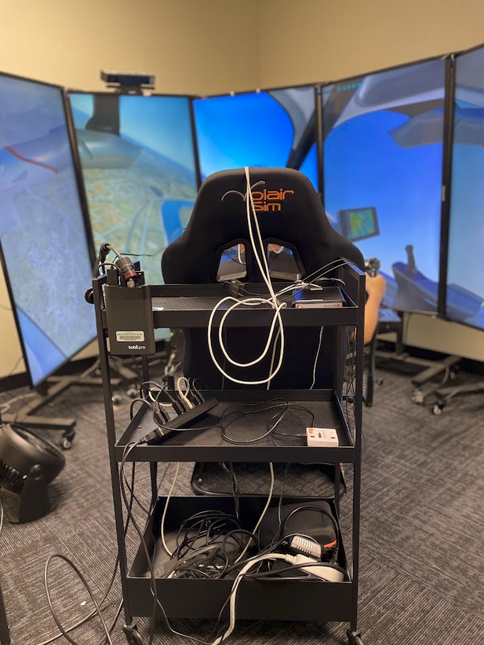

I am a second-year master's student in the Department of Mechanical Engineering at Carnegie Mellon University (CMU). My work and interests primarily focus on multimodal machine learning, self-suprevised learning, on-device machine learning, and model compression for optimizaition and improved efficiency. In general, my research interests revolve around the real-world applications of AI/ML in various fields.
  
As you navigate through my pages, I suggest you explore the narrative journey into each of my projects and see how it is tightly knitted with my focus and interests. Each of my works has provided a great foundation and practice for building my knowledge and shaping it to apply to real-world applications and challenges. From building a naive human facial emotion classifier to developing a multimodal ML model to estimate pilots' stress levels, it has taken me a good amount of effort and passion, which permeates my work.
  
<h1>Research Interests</h1>
<table style="border: none; border-collapse: collapse;">
  <tr>
    <td style="padding: 10px; border: none;">
      

        
      

    </td>
    <td style="padding: 10px; border: none; vertical-align: top; font-size: 18px;">
      <b>I primarily focus on using deep learning and machine learning models to conduct statistical estimators in various fields, such as aviation, autonomous driving, robotics, and biomedical applications.</b> My recent research project has been concentrating on building and training multimodal machine learning models to estimate pilots' workload during various flight operations. I am also interested in LLMs and their applications. I am currently working on a Q&A chatbot system that leverages retrieval-augmented generation (RAG) to mitigate hallucination in LLMs.
    </td>
  </tr>
</table>

