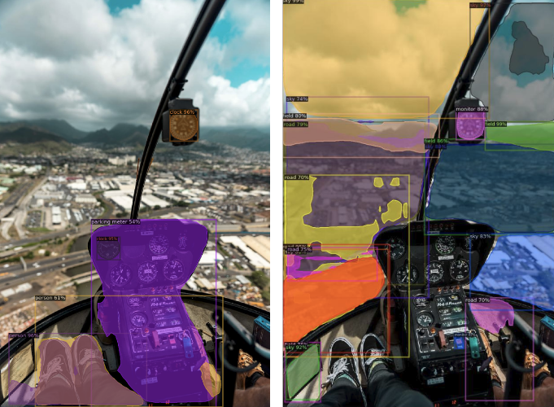
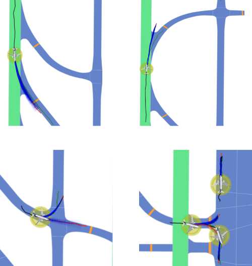
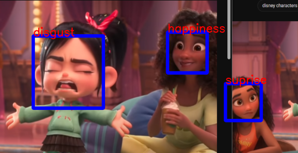
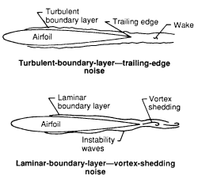

## Q&A Chatbot with LLMs via Retrieval Augmented Generation for Hallucination Mitigation
<table style="border: none; border-collapse: collapse;">
    <tr>
        <td style="padding: 0px; border: none;">
            

                
            

        </td>
    </tr>
    <tr>
        <td style="padding: 10px; border: none; vertical-align: top; font-size: 16px;">
            <b>Jan 2024 - Present</b> 
            We are developing a Q&A chatbot system that leverages retrieval-augmented generation (RAG).
            The core idea of RAG is to mitigate hallucination often observed in large language models (LLMS).
            We are currently tackling multiple challenges, including further hallucination mitigation, document vectorization and search, fine-tuning the LLM, and faster inference of query responses.
            Furthermore, we are developing a web application so that users can easily upload documents and query the chatbot.
             
            <a href = "https://sjhpark.github.io/project_desc/RAG">More</a> | <a href="https://github.com/sjhpark/QuestionAnswering-LLM.git">GitHub</a>
        </td>
    </tr>
</table>
---

## Pilot Workload Estimation via Multimodal Machine Learning
<table style="border: none; border-collapse: collapse;">
    <tr>
        <td style="padding: 10px; border: none;">
            

                
            

        </td>
        <td style="padding: 10px; border: none; vertical-align: top; font-size: 16px;">
            <b>This project is sponsored by a research subsidiary of an automotive company.</b>
              
            <b>May 2023 - Present</b> 
            Currently being involved in the development of a multimodal machine learning model aimed at estimating eVTOL (electric Vertical Take-off & Landing) aircraft pilot workload during various flight operations. As a member of a team consisting of researchers and engineers, we have been collecting multimodal biometric data (including Heart Rate, Eye Gaze, GSR, etc.) from pilots engaged in simulated flights with a VTOL aircraft.
            Our data collection process includes obtaining ground truth labels for pilot workload, gathered through pilots' self-evaluation using the NASA Task Load Index (TLX) questionnaire. Additionally, we are currently engaged in signal processing of the collected data and working on building a multimodal machine learning feature extraction system to estimate pilot workload.
             
            <a href = "https://sjhpark.github.io/project_desc/pilot_workload">More</a>
        </td>
    </tr>
</table>
---

## Large Generative Model On-Device Deployment & Optimization
<table style="border: none; border-collapse: collapse;">
    <tr>
        <td style="padding: 10px; border: none;">
            

                
            

        </td>
        <td style="padding: 10px; border: none; vertical-align: top; font-size: 16px;">
            <b>Sept - Dec 2023</b> 
            Deployed and optimized a large generative model (72 million parameters) for a virtual garment try-on system based on the model proposed by <a href = "https://openaccess.thecvf.com/content/CVPR2021/papers/Ge_Parser-Free_Virtual_Try-On_via_Distilling_Appearance_Flows_CVPR_2021_paper.pdf">Parser-Free Virtual Try-on via Distilling Apperance Flows (2021)</a>, on an NVIDIA Jetson Nano 4GB. The model is convolution and residual connection-based, consisting of two sub-models: the Warping model and the Generative model. As a member of a team of five, I was responsible for compressing the model using various techniques such as quantization, pruning, and model knowledge distillation. Additionally, I conducted sensitivity analysis to evaluate each convolution channel and layer concerning compression techniques.
             
            <a href = "https://sjhpark.github.io/project_desc/on_device_ml">More</a> | <a href="https://github.com/sjhpark/Virtual-Try-On-Deployment-Kit.git">GitHub</a>
        </td>
    </tr>
</table>
---

## Cockpit View Segmentation for Adaptive Copilot Systems
<table style="border: none; border-collapse: collapse;">
    <tr>
        <td style="padding: 10px; border: none;">
            

                
            

        </td>
        <td style="padding: 10px; border: none; vertical-align: top; font-size: 16px;">
            <b>2nd place for the best presentation in CMU's 16-824 Visual Learning & Recognition in Fall 2023</b>
              
            <b>Nov - Dec 2023</b> 
            <b>Motivation:</b> With the growing focus on urban air mobility, the development of next-generation air mobility systems has become
            a paramount area of research. This project is motivated from a semi-autonomous approach, wherein pilots remain within the aircraft, supported by advanced co-pilot systems to alleviate their workload during flight operations.
            To enhance adaptive co-pilot systems, a key aspect is identifying instances when pilots experience high workloads, and one effective
            method for workload assessment is analyzing pilots’ eye gaze. 
            The instance segmentation approach enables a granular understanding of the pilot’s visual focus, contributing valuable insights into workload distribution during different phases of flight.
              
            As a member of a team of three, I took charge of custom data collection and preprocessing, and the development, training, and evaluation of the instance segmentation model. I used Detectron2, an open-source object detection and instance segmentation platform provided by FAIR (Facebook AI Research) to train and fine-tune a pre-trained model for instance segmentation.
             
            <a href = "https://sjhpark.github.io/project_desc/cockpit_view">More</a> | <a href="https://github.com/sjhpark/pilotview_segmentation.git">GitHub</a>
        </td>
    </tr>
</table>
---

## Motion Prediction in Airports using Heterogeneous Map Representations
<table style="border: none; border-collapse: collapse;">
    <tr>
        <td style="padding: 10px; border: none;">
            

                
            

        </td>
        <td style="padding: 10px; border: none; vertical-align: top; font-size: 16px;">
            <b>This project was sponsored by Boeing</b>
              
            <b>Summer 2023</b> 
            As a member of a team of multiple researchers at Carnegie Mellon University, I was responsible for analyzing the effects of using different airport map representations on aircraft motion forecasting models during the summer of 2023. My teammates and I explored two approaches for airport map representations: (1) rasterized images of HD maps and (2) graph-based vectorized maps. Our objective was to compare these two methods, as different representations offer diverse contextual information that can be leveraged to train models.
            To train our motion forecasting models with aircraft trajectory data, we utilized the SWIM (System Wide Information Management) dataset. We employed SWIM-TF, a transformer-based framework that evaluates various scenario representation methods and feature encodings while maintaining the same overall architecture, ensuring a consistent comparison.
              
            <i>This project was also a joint research effort carried out by the Carnegie Mellon University's Summer 2023 RISS (Robotics Institute Summer Scholars) student, Pablo Ortega-Kral.</i>
             
            <a href = "https://sjhpark.github.io/project_desc/aircraft_traj_pred">More</a>
        </td>
    </tr>
</table>
---

## Human Facial Emotion Recognition & Classification
<table style="border: none; border-collapse: collapse;">
    <tr>
        <td style="padding: 10px; border: none;">
            

                
            

        </td>
        <td style="padding: 10px; border: none; vertical-align: top; font-size: 16px;">
            <b>Sept - Dec 2022 (very first ML team project)</b> 
            Built a CNN model to recognize and classify human emotions from facial images as a part of a semester-long machine learning team project.
            The objective was to build and train a model that can identify the emotion of a person from its face. As a member of a five person team, 
            I took charge of the data collection and preprocessing. Furthermore, I was responsible for the development, training, and evaluation of the CNN model.
             
            <a href = "https://sjhpark.github.io/project_desc/emotion_recog">More</a> | <a href="https://github.com/sjhpark/Facial_Emotion_Classifier.git">GitHub</a>
        </td>
    </tr>
</table>
---

## Airfoil Noise Prediction using Feedforward Neural Networks
<table style="border: none; border-collapse: collapse;">
    <tr>
        <td style="padding: 10px; border: none;">
            

                
            

        </td>
        <td style="padding: 10px; border: none; vertical-align: top; font-size: 16px;">
            <b>Feb 2023 (personal project)</b> 
            Developed a feedforward neural network model to predict varying size NACA 0012 airfoils' noise levels 
            based on the airfoil geometry and flow conditions.
            The model was trained on the UCI Airfoil Self-Noise Data Set, which contains airfoil features and the corresponding noise levels.
            <ul style="list-style-type:disc">
                <li>Frequency [Hz]</li>
                <li>Angle of attack [degrees]</li>
                <li>Chord length [m]</li>
                <li>Free-stream velocity [m/s]</li>
                <li>Suction side displacement thickness [m]</li>
                <li>Scaled Sound Pressure Level [dB]</li>
            </ul>
            Achieved average MSE validation error of 3.13 dB for the scaled sound pressure level after 500 epochs of training.
             
            <a href="https://github.com/sjhpark/Airfoil-Self-Noise-Prediction">GitHub</a>
        </td>
    </tr>
</table>
---

## Planar Robot Arm Controller
<table style="border: none; border-collapse: collapse;">
    <tr>
        <td style="padding: 10px; border: none;">
            

                
            

        </td>
        <td style="padding: 10px; border: none; vertical-align: top; font-size: 16px;">
            <b>Feb 2023 (personal project)</b> 
            Created a mouse-interactive controller for the movement of a 3-jointed planar (2D) arm end-effector in Python.
             
            The controller uses the following algorithms:
            <ul style="list-style-type:disc">
                <li>Inverse Kinematics for calculating each joint angle, given the desired (x,y) position of the end effector.</li>
                <li>Forward Kinematics for moving the each arm segment and the end effector to the corresponding position when given joint angles.</li>
            </ul>
            Users can click anywhere in the grid in the controller window to move the 3R planar maniuplator.
             
            <a href="https://github.com/sjhpark/Planar-Robot-Arm-Controller">GitHub</a>
        </td>
    </tr>
</table>
---

## Depth Map of Vehicle Stereo Vision Road Views
<table style="border: none; border-collapse: collapse;">
    <tr>
        <td style="padding: 10px; border: none;">
            

                
                
            

        </td>
        <td style="padding: 10px; border: none; vertical-align: top; font-size: 16px;">
            <b>Feb 2023 (personal project)</b> 
            Disparity map is used in conventional computer vision to reconstruct the 3D depth structure of a scene from two stereo vision images (left and right).
             
            In this project, I computed disparity maps from vehicle road view images using KITTI Stereo 2015 dataset.
             
            <a href="https://github.com/sjhpark/Depth-Map.git">GitHub</a>
        </td>
    </tr>
</table>
---
