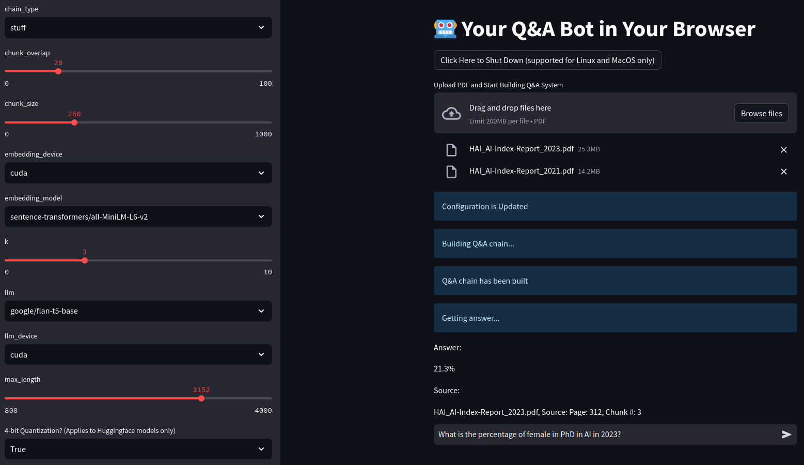

<h2>Motivation</h2> 
Q&A systems with large language models (LLMs) have shown remarkable performance in generating human-like responses. 
However, LLMs often suffer from hallucination and generate plausible but incorrect information.
<h2>Introduction</h2> 

    

To address this issue, we are developing a Q&A chatbot system that leverages retrieval-augmented generation (RAG).
RAG allows users to vectorize and store documents (we are using PDF format) in a grounded database,
and conducts similarity and semantic search to retrieve the most relevant information when a user asks a question.
The retrieved information is then converted into a human-like response by the LLM.
  
<h2>Research Challenges</h2> 
We are in the research phase of this project and are currently focusing on the following challenges:
<ul>
    <li>Choosing an LLM to use for the human-like text generation part of the system.</li>
    <li>Choosing a model to use as an embedding model to vectorize the documents.</li>
    <li>Generalizing the retrieval system to handle different types of documents.</li>
    <li>Further mitigating hallucination in the LLM.</li>
    <li>Finding evaluation metrics to measure the performance of the retrieval system.</li>
    <li>Fine-tuning the LLM to generate human-like responses if performance is not satisfactory.</li>
    <li>Optimizing the inference time and memory usage of the retrieval system.</li>
    <li>Developing a user-friendly interface for the web application.</li>
</ul>
  
<h2>Web Application</h2> 
We are currently developing a web application that allows users to upload PDF documents and ask questions.
The application is still in the basic stage, but we are planning to refine inference time, memory usage, and user interface.

    

