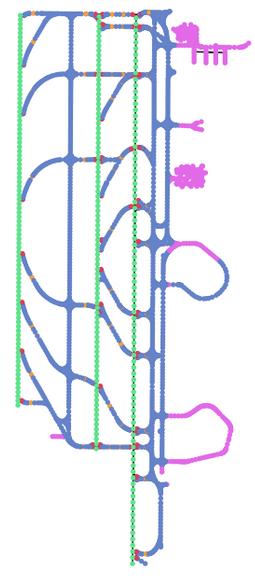
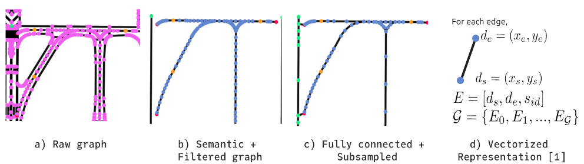
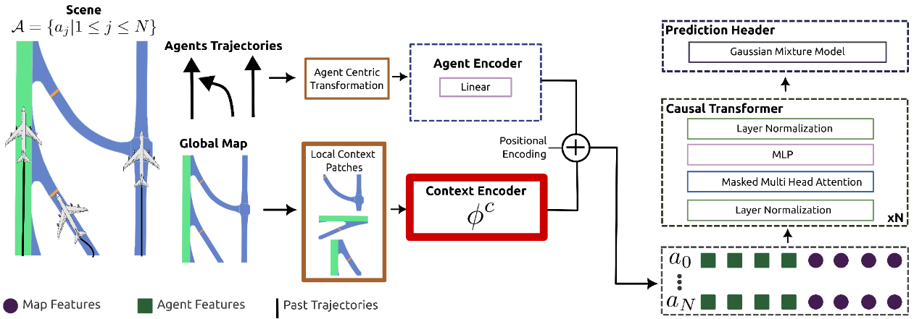
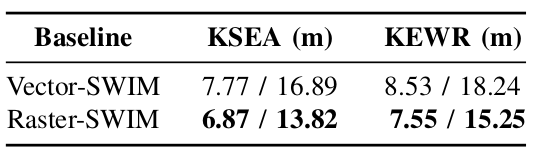
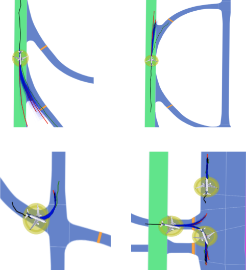

<h2>Motivation</h2> 
Ensuring safety in airport ground operations is crucial to prevent catastrophic collisions, known as incursions. Human monitoring is currently relied upon to identify and correct potential risks. Motion forecasting models, underexplored in aviation, offer promise in automating the detection of safety-critical situations. This project focuses on studying the impact of different map representations on these models for enhancing situational awareness in aviation safety systems.
  
<h2>Data</h2> 
The current trajectory data, collected through the Federal Aviation Administration's (FAA) System Wide Information Management (SWIM) platform, spans 200 days of movement between Seattle-Tacoma Airport (KSEA) and Newark Airport (KEWR).

    

    

 
Specifically, we utilized the SWIM Terminal Data Distribution System (STDDS) for trajectory data, collecting information about aircraft and operational vehicles from 6 FAA systems. These systems include Airport Surface Detection Equipment – Model X, Airport Surface Surveillance Capability, Standard Terminal Automation Replacement System, Runway Visual Range, Electronic Flight Strip Transfer System, and Tower Data Link Services. The data, spanning 200 days from December 1 to June 19, 2023, provides details on altitude, speed, heading, vehicle type, and 2D geographical coordinates. We processed the information to describe positions in a local Cartesian frame unique to each airport, grouping it into 30-second-long scenarios.
  
<h2>Airport Map Representations</h2> 
We processed the airport maps into two different representations (1) rasterized images of HD maps and (2) graph-based vectorized maps.
Furthermore, we imbued semantic information in their nodes and vertices.
 
<b>1) Raster Representation:</b> To obtain the raster represen-
tation we simply view the polygons formed by the elements
of the map as shapes on an image. To retain semantic
information, a specific color is assigned to each semantic
class.

    

 
<b>2) Graph Representation:</b> We processed the airport maps by vectorizing them. In the figure below: a) Shows the graph before processing. b) Shows the remaining centerlines after categorizing each node into Runway, Taxiway, Hold-short Line, or exit and eliminating pavement and marking areas. c) Shows the graph after connecting each runway, connecting each exit node to the nearest runway, and eliminating redundant nodes. d) Shows the vectorization process of the graph.

    

  
<h2>Model & Pipeline</h2> 
The motion forecasting model architecture adopts a multi-modal joint prediction approach, utilizing an agent-centric representation for trajectories and local context patches. The agent encoder incorporates a linear layer, while the context encoder varies based on the chosen map representation. In this project, we compared CNN-based and MLP-based encoders with and without attention layers for rasterized and graph representations. A GPT-2 style causal encoder performs masked attention over trajectories. Lastly, a Gaussian Mixture Model (GMM) serves as the prediction header, representing future trajectories as a probabilistic distribution for each time step.
 
To train our motion forecasting models with aircraft trajectory data, we utilized the SWIM (System Wide Information Management) dataset. We employed SWIM-TF, a transformer-based framework that evaluates various scenario representation methods and feature encodings while maintaining the same overall architecture.

    

  
<h2>Evaluation</h2> 
We assessed motion forecasting models by inputting historical aircraft trajectories in airports and corresponding map patches in two representations, rasterized and vectorized. In both cases, raster-based context slightly outperforms the vector-based context. In KSEA, raster-based context has a 0.9 lower ADE and a 3.07 lower FDE than vector-based. In KEWR, ADE differs by 0.98, and FDE by 4.42. Despite the scale of aircraft, these differences are relatively low, suggesting that both context encoding methods are learning similar features from the provided information.

    

    

    

  
<i>I would like to express my sincere gratitude to Pablo Ortega-Kral for his substantial contributions to this project. Pablo played a pivotal role in the execution of the research, including the primary work and creation of figures presented in this project. His dedication and expertise significantly enriched the outcome of this study.</i>
