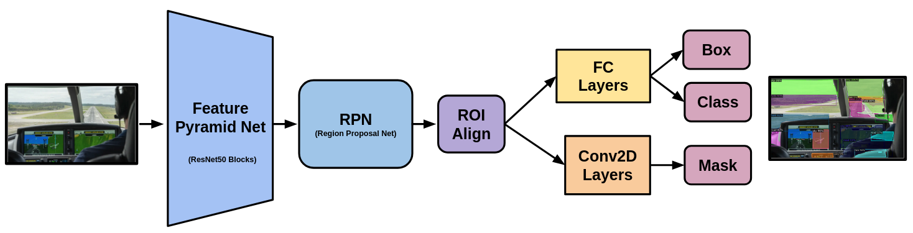
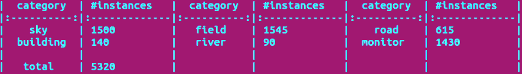
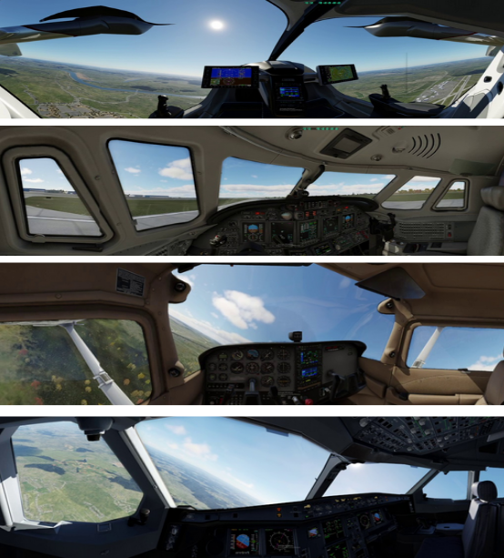
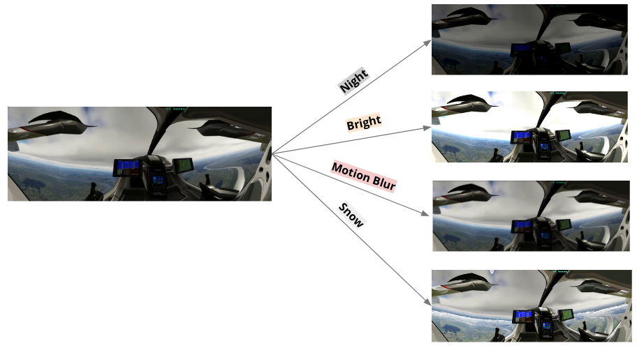
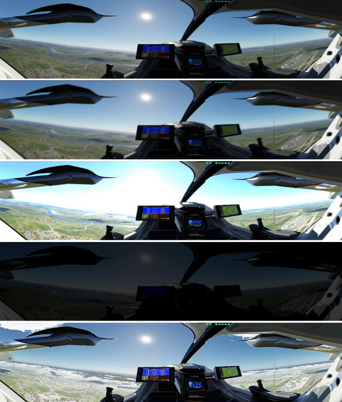
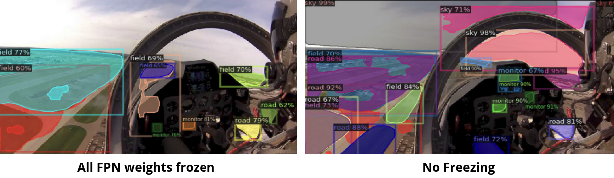

<h2>Motivation</h2> 
With the growing focus on urban air mobility, the development of next-generation air mobility systems has become
a paramount area of research. This project is motivated from a semi-autonomous approach, wherein pilots remain within the aircraft, supported by advanced co-pilot systems to alleviate their workload during flight operations.
To enhance adaptive co-pilot systems, a key aspect is identifying instances when pilots experience high workloads, and one effective
method for workload assessment is analyzing pilots’ eye gaze. 
The instance segmentation approach enables a granular understanding of the pilot’s visual focus, contributing valuable insights into workload distribution during different phases of flight.
  
<h2>Introduction</h2> 
Our project tackles the challenge of segmenting instances that pilots inside aircraft would see through two methods: closing sim2real gap and domain adaptation to aviation domain.

    

  
<h2>Model</h2> 
We employed a Mask R-CNN for cockpit view instance segmentation, utilizing a feature pyramid network (FPN) based on ResNet50 blocks to extract feature maps. Subsequently, a region proposal network (RPN) was utilized to identify regions of interest (ROI). A notable feature of Mask R-CNN is the incorporation of ROI Align, representing an improvement over traditional ROI Pooling. This introduction of ROI Align addresses the issue of quantized strides by employing bilinear interpolation, contributing to a more precise localization of features within the regions of interest. We fine-tuned this model with our custom dataset utilizing Detectron2, an open-sourced platform for object detection and segmentation developed by FAIR (Facebook AI Research), on a Mask R-CNN pretrained on the COCO2017 dataset.

    

  
<h2>Why Not Transformer Based Model?</h2> 
We chose to use a convolution-based model for the instance segmentation task. Our hypothesis is that transformer-based models exhibit a relatively relaxed inductive bias compared to other types of models (CNN, RNN, etc.). This is because transformers extract features from input data through attention layers that identify relationships without specific prior knowledge. However, this relaxed inductive bias requires a large dataset to train the model. In contrast, CNNs employ convolution layers, shaping input data into convolved features. In other words, CNNs possess prior knowledge from convolution layers that guide the model to extract features related to high-level and low-level shapes from input images. This prior distribution further shapes the posterior distribution, enabling the model to learn and generate desired outputs with a relatively smaller dataset, which is more suitable for our case.
  
<h2>Method 1: Sim2Real Gap Reduction</h2> 
The segmentation of cockpit views is a novel concept, yet exploring it poses challenges due to the complexities and costs associated with obtaining real cockpit views observed by pilots. To overcome these challenges, we strategically chose to collect data from a flight simulator, reducing costs and addressing safety concerns.
The aim of narrowing the sim-to-real gap is to enable the algorithm, trained on simulated data, to effectively and accurately segment instances in real-world cockpit views. This objective enhances the system's reliability and practical applicability.
 
<h3>Data Collection</h3> 
Initially, we curated a custom dataset by navigating aircraft in the first-person view using a flight simulator.
The entire flight operations were recorded using OBS Studio, an open-source screen capturing software.

    

 
<h3>Labels</h3> 
We defined six classes (sky, field, road, building, river, monitor) representing typical visual elements encountered by urban air mobility pilots during flight.
We generated ground truth labels for each simulated image in our collection by segmenting all objects classifiable into one of our six predefined categories (sky, field, road, building, river, monitor). 
For this segmentation task, we utilized Make Sense AI, an open-source platform designed for efficient instance segmentation.

    

  
<h2>Method 2: Domain Adaptation</h2> 
The primary focus was to analyze the domain adaptation of
our pretrained model to the aviation domain. In our custom
dataset, we employed two techniques to ensure robust and
generalized adaptation: 1. Collecting different types of aircraft and 2. Applying data augmentation.
 
<h3>Various Types of Fleets</h3> 
We utilized different types of aircraft in the simulation to capture frames of cockpit views.

    

 
<h3>Cockpit View Augmentation</h3> 
we devised unique image augmentation methods using Kornia and PyTorch’s Transforms, both open-source computer vision libraries. 
We opted for a combination of augmentations to create filters such as Night, Bright, Motion Blur, and Snow, to simulate diverse
view conditions, including different weather and lighting
scenarios and resemble the diversity found in real-world conditions.

    

    

  
<h2>Discussion</h2> 
Following the fine-tuning of the model using simulation-
derived data, we evaluated its performance on actual flight
cockpit images. Visual examination revealed the model’s
ability to accurately segment the images into distinct
classes. Additionally, we conducted experiments involving fine-tuning tasks, selectively
freezing various blocks of the model. Notably, fine-tuning
without freezing any weights led to significantly improved
segmentation, especially in comparison to maintaining the
feature pyramidal network in a frozen state. This implies that fine-tuning the FPN
played a pivotal role in enhancing the model’s capacity to
effectively comprehend our customized dataset.

    

  
<h2>Future Work</h2> 
While assessing the model's performance with real-world data, we identified limitations, particularly when testing the F16 fighter jet cockpit in an inverted position. The model struggled to accurately recognize the cockpit orientation, mistaking the sky for the field and vice versa. To enhance robustness to positional variations, we propose to apply geometric augmentation to the training dataset, aiming to improve the model's ability to recognize instances in non-standard orientations and mitigate the issue of positional invariance.

    

 
<b>Our custom dataset and fine-tuned models can be accessed through the QR code below.</b>

    

