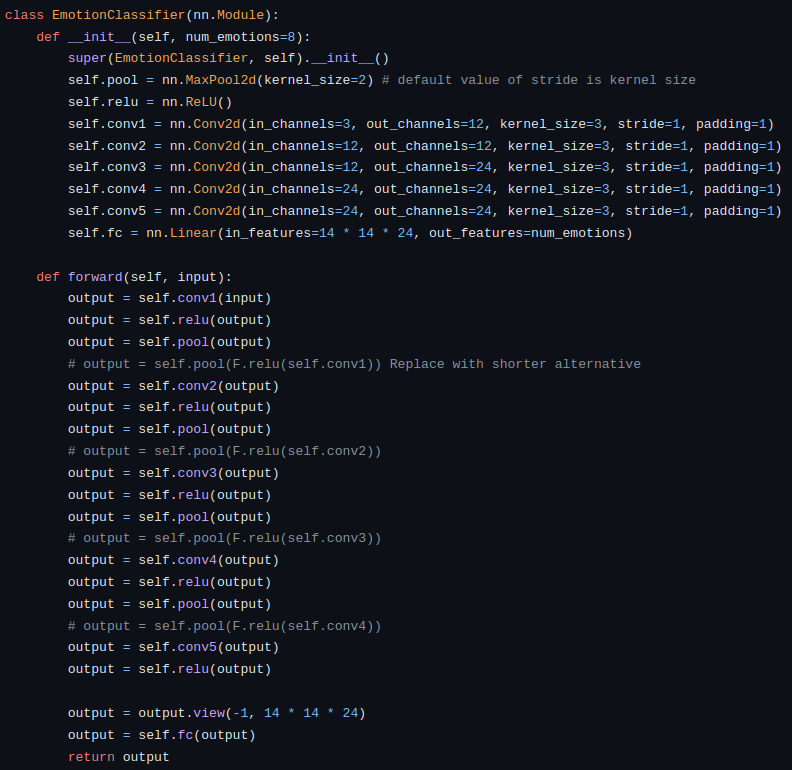
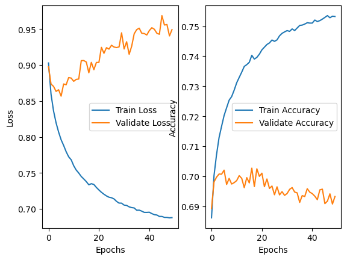
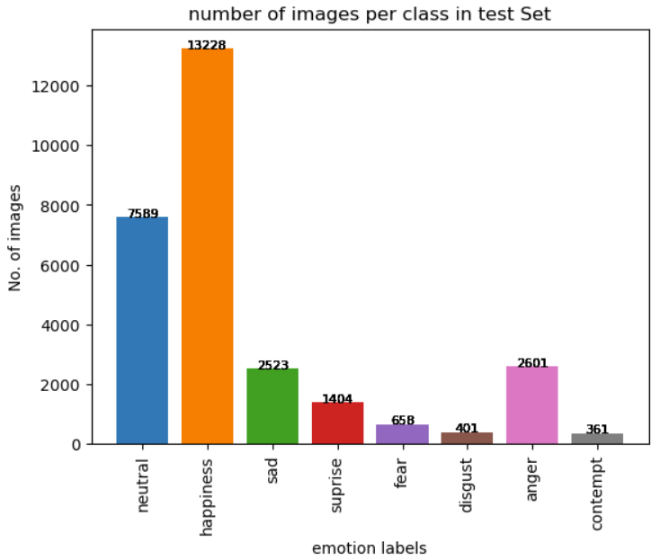
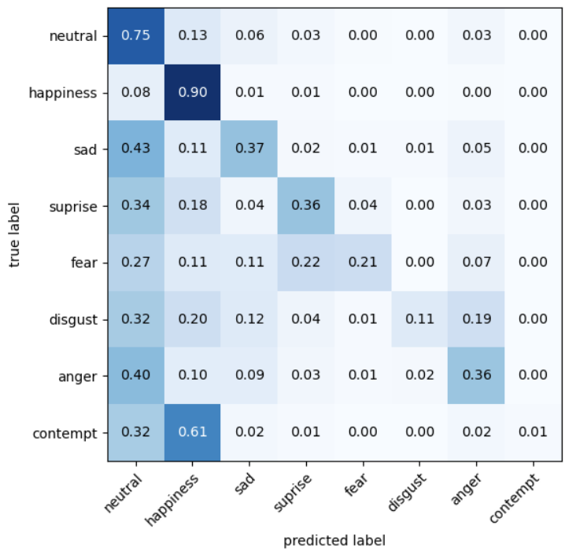
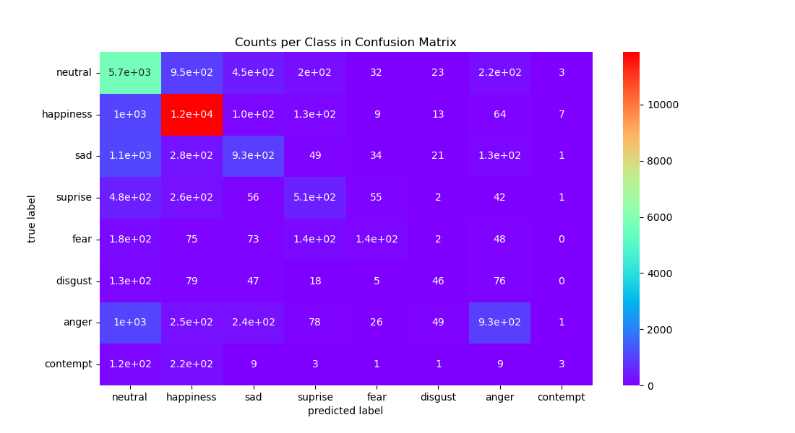
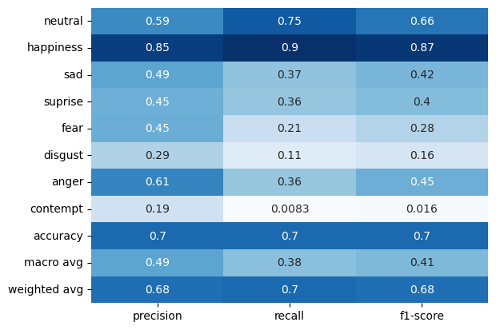

<h2>Motivation</h2> 
Facial emotion recognition (FER) has diverse applications in healthcare, human interactions, and customer satisfaction, playing a crucial role in predicting psychological states during social interactions. Recognizing emotions from facial expressions holds great potential for understanding consumer mental states and improving user satisfaction. We employed machine learning and computer vision techniques to detect and classify human facial emotion expressions.
  
<h2>Introduction</h2> 
This was my very first machine learning team project. As a member of a team of five, I was responsible for the entire project pipeline, including development, training, evaluation, and demonstrating the trained model. Here, we trained a baseline CNN with the mini version of AffectNet benchmark and achieved around 70% accuracy on predicting emotions per facial expressions.
<video controls="controls" width="800" height="450">
  <source src="../images/emotion_recog/demo.mp4">
</video> 
  
<h2>Model</h2> 
We built a baseline Convolutional Neural Network (CNN) model to identify a person's emotion based on facial expressions. The project aims to leverage existing machine learning and computer vision approaches to train a model capable of distinguishing and classifying various facial emotion expressions (e.g., 'happy,' 'sad,' 'angry') from given images of human faces. The model was trained and tested using the mini version of the AffectNet benchmark image dataset.

    

  
<h2>Dataset</h2> 
We used the mini version of <a href = "http://mohammadmahoor.com/affectnet/">AffectNet</a>, a benchmark human facial expression dataset. 
This mini version, comprising 291,651 images, focuses on eight labels. Released since March 2021, it includes manually annotated images with labels ranging from 0 to 7. The images are cropped and resized to 224 x 224 pixels (RGB color). The database contains the 8 expression labels, Arosal/Valence values, and facial landmark points for the training and validation sets. For our project, we specifically utilized the 8 facial expression labels.
  
<h2>Training & Evaluation</h2> 
We trained our CNN model for approximately 50 epochs. At that time, we were not familiar with techniques like regularization to prevent overfitting. Additionally, being newcomers to the "Machine Learning" field, we were not yet aware of the concept of "overfitting." Despite this lack of knowledge, we managed to achieve around 70% validation accuracy, even though the model was overfitting with a training accuracy of 75%. If I were to redo this project, I would implement regularization techniques such as Lasso Regression (L1), Ridge Regression (L2; Weight Decay), batch normalization, dropout, drop block, early stopping, etc. Furthermore, I would employ pixel-wise and geometric image augmentation to introduce variance to the training data, enhancing the model's ability to generalize.

    

  
<h2>Analysis</h2> 
We conducted a comprehensive analysis of our trained model, computing a confusion matrix along with precision, recall, and F1 scores. Upon revisiting the label distribution in the dataset, we observed that a few labels (Neutral and Happy) dominated over 70% of the entire dataset. This led to confusion between contempt and happy emotions. For future work, implementing regularization and data augmentation methods, along with a more sophisticated model architecture such as utilizing residual blocks or a U-shape network, could enhance feature extraction from facial images.

    

    

    

    

