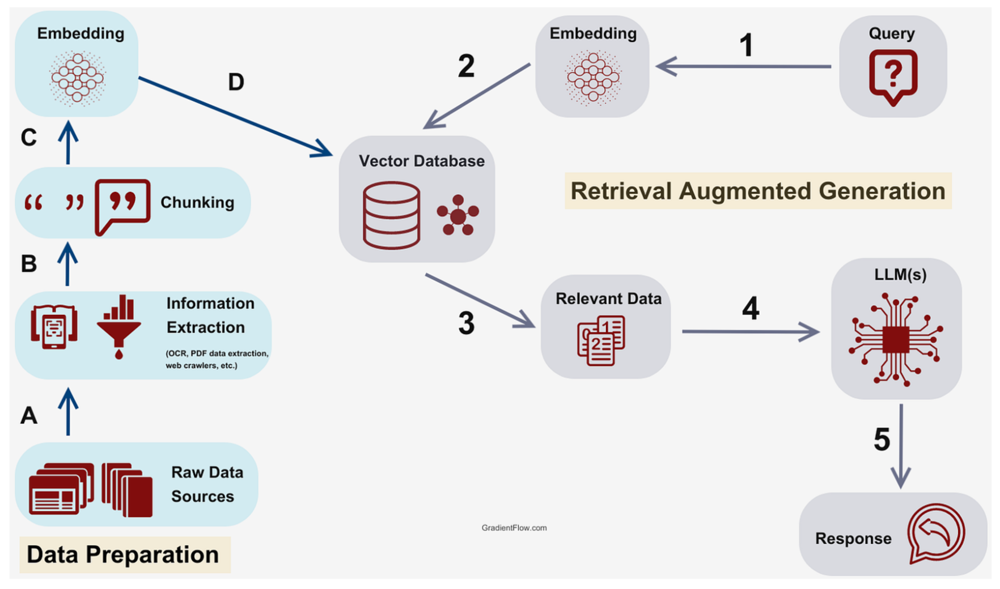

<h2>Motivation</h2> 
Large Language Models often struggle with mathematical computations and factual accuracy, leading to unreliable outputs in specialized tasks. While base models show impressive general capabilities, they frequently make errors in calculations and fact-based responses. Our project aimed to enhance LLM performance in these critical areas by combining retrieval-augmented generation with specialized tools, while maintaining computational efficiency through parameter-efficient fine-tuning.

<h2>Introduction</h2> 

    

This project addressed the challenge of improving language model accuracy for specialized tasks, particularly in mathematical computations and factual queries. Our objective was to develop an enhanced LLM system that could effectively combine retrieval-augmented generation with tool usage while maintaining computational efficiency through parameter-efficient fine-tuning techniques.
  
<h2>Methods</h2> 
We built the system using the Pythia-1B language model as our foundation, implementing Low-Rank Adaptation (LoRA) for efficient fine-tuning. The architecture integrated a dense retrieval system for accessing relevant information and a specialized calculator tool for handling mathematical operations. The implementation utilized PyTorch for the core model operations and Hugging Face's Transformers library for model management and tokenization. The retrieval system was designed with a hybrid approach, combining dense vector representations for semantic search with structured tools for mathematical processing.

  
<h2>Results</h2> 
Performance testing demonstrated significant improvements in model capabilities. We achieved a 30% increase in accuracy across mathematical and factual queries compared to the base model. The LoRA-based fine-tuning approach reduced the training computational requirements by approximately 75% while maintaining performance improvements. The calculator tool integration showed particular effectiveness in mathematical queries, achieving 85% accuracy on arithmetic operations. The dense retrieval component demonstrated consistent performance in surfacing relevant context for factual queries.
 
  
<h2>Discussion</h2> 
The project successfully demonstrated the effectiveness of combining multiple enhancement techniques in a single LLM system. Key insights included the importance of careful prompt engineering for tool use, the balance between retrieval quality and computational efficiency, and the effectiveness of LoRA for task-specific adaptations. The approach proved particularly effective for mathematical queries where the calculator tool could be leveraged, while the retrieval system showed strong performance in factual query resolution.
  

<h2>Role and Contribution</h2> 
I designed and implemented the RAG architecture, including the dense retrieval system and calculator tool integration. I was responsible for implementing the LoRA fine-tuning process, optimizing the retrieval system parameters, and developing the evaluation framework for measuring accuracy improvements. 
  
<!-- 

    

 -->
