<h2>Motivation</h2> 
Convolution-based and language-based models have made significant performance strides in the last decade, exemplified by AlexNet surpassing human performance in image recognition in 2015 and the impactful roles played by models like GPT, BERT, and Llama in advancing language understanding. Despite these advancements, the rapid growth in model complexity and size has outpaced the progress in AI deployment technologies, necessitating increased attention to model compression for efficient deployment on smaller devices. With a focus on deploying a large convolution-based model for virtual garment warping on a small device, our project introduces post-training compression methods aimed at maintaining original performance while enhancing efficiency.
  
<h2>Introduction</h2> 
As a member of a team of five, I was responsible for compressing a large generative model (72 million parameters) for a virtual garment try-on system based on the model proposed by <a href = "https://openaccess.thecvf.com/content/CVPR2021/papers Ge_Parser-Free_Virtual_Try-On_via_Distilling_Appearance_Flows_CVPR_2021_paper.pdf">Parser-Free Virtual Try-on via Distilling Apperance Flows (2021)</a>, on an NVIDIA Jetson Nano 4GB. I optimized the model efficiency through various model compression techniques such as quantization, pruning, and model knowledge distillation. Additionally, I conducted sensitivity analysis to evaluate each convolution channel and layer concerning compression techniques.

    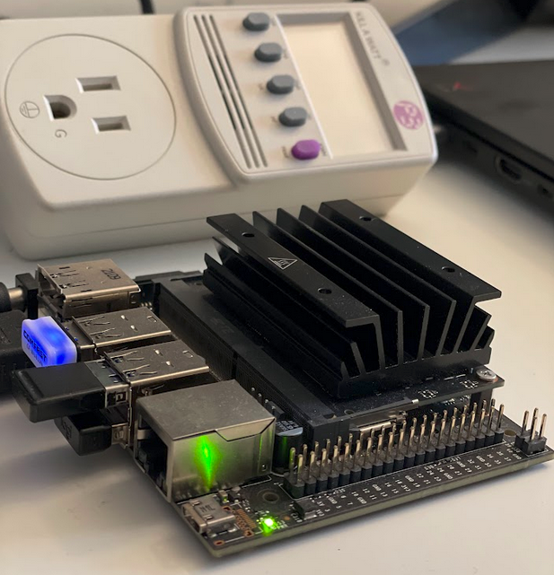

    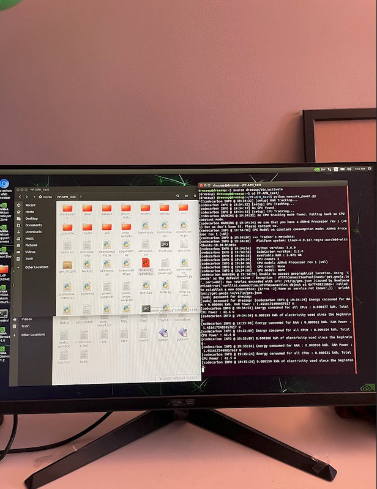

  
<h2>Model</h2> 
The model we have chosen for the project is Parser-Free
Appearance Flow Network (PFAFN). This model has over
70 million parameters and aims to warp input clothe and
person images to output an image of the person wearing
the clothe. The model comprises two modules, a genera-
tive model (43 million parameters) and a apperance flow warping model
(29 million parameters).

    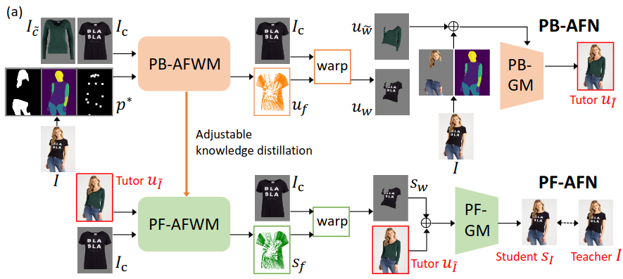

    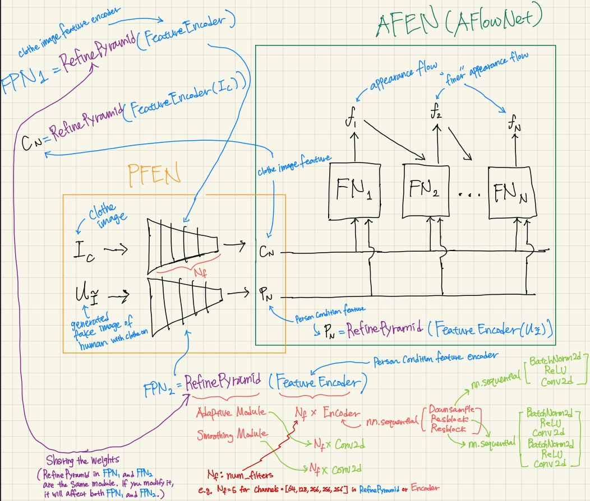

  
<h2>Data</h2> 
The training data is the clothes image Ic and the image
I of a person wearing the clothes. Parser-based network
PB-AFN randomly selects a different clothes image I ̃c to
synthesize the fake image uI e as the tutor. The tutor uI e
output and the clothes image Ic as inputs to train the parser-
free network PF-AFN, where the generated student sI is
directly supervised by the real image I. Please note that al-
though the original process encompassed multiple stages of
training, including both the teacher and student networks,
our emphasis was primarily on the PF-AFN stage.

    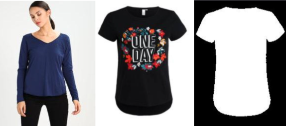

  
<h2>Pruning - Warping Model</h2> 
We selectively reduced or ’silenced’ the activity of each
block via structured pruning. By doing so, we could ob-
serve how the output quality changes and identify which as-
pects of the output are most affected when different levels
of our system are less active or more ’sparse’.

    

  

    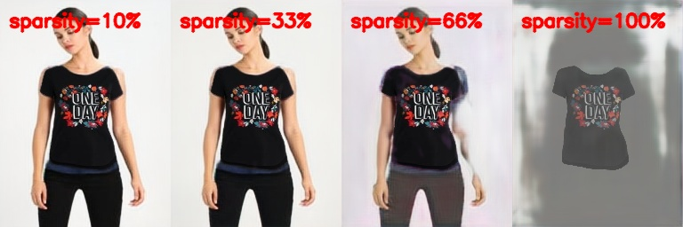

  

    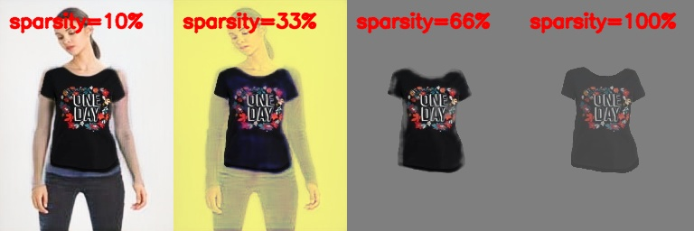

  

    

  
  
<h2>Pruning - Warping Model</h2> 
Unlike the sensitivity analysis conducted with unstructured
pruning, I performed a sensitivity analysis on AFWM’s
human condition feature encoder and clothing image fea-
ture encoder using a structured pruning method. Structured
pruning is a technique designed to compress a model by
selectively remov- ing specific layers or weights of tensors
within the model. Our structured pruning approach involves
filter pruning, a variation of channel pruning. Tradition-
ally, filter pruning is executed by ranking each filter within
the layers using criteria such as L1-Norm or Entropy
to assess the importance of each filter. Departing from this
conventional method, I chose to run inference directly
with our pruned model, systematically pruning one specific
filter at a time. I pruned the first 64 filters per layer, given
that the smallest convolution layers in the encoders, except
for those in the downsampling block, have 64 output channels (filters). 
Since AFWM comprises multiple convolution layers, each followed by batch normalization, 
I had to adapt our architecture. Specifically, I adjusted the number of input channels for the first subsequent convolution
layer by decreasing it by one. Additionally, I reduced the
number of features for the first subsequent batch normaliza-
tion, including its bias, running mean (moving mean), and
running variance (moving variance), by one as well.

    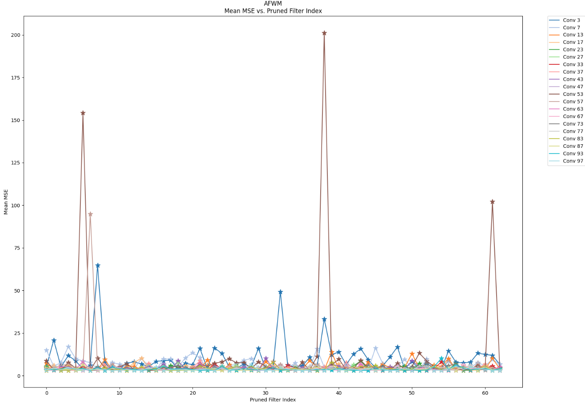

    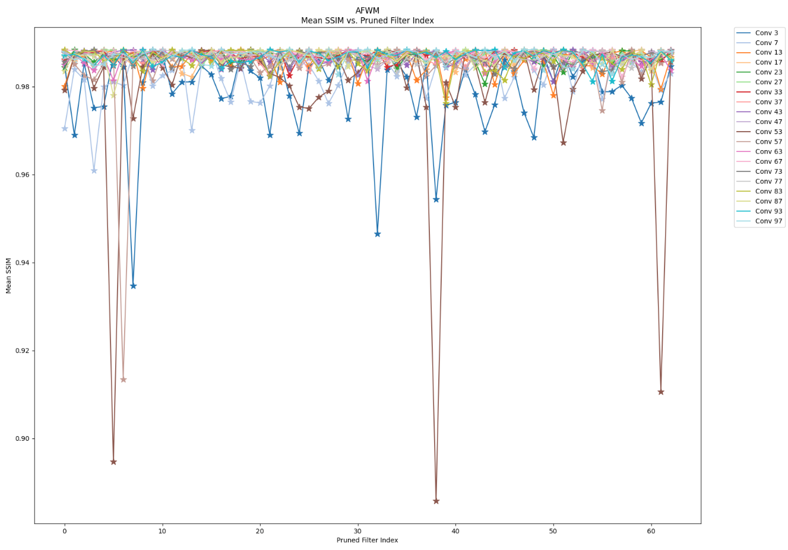

 
Through filter-wise structured pruning in a post-training regime,
I have reached the conclusion that the mid layers in the encoders and networks within the Appearance
Flow Warp Network are the least sensitive to pruning. In contrast, the initial layers are the most sensi-
tive, as they capture the highest-level and global features of the input images.
Furthermore, the performance drop after pruning the initial layers is
attributed to specific filters within those layers. Therefore, the performance of the
initial layer is dependent on certain filters, which I refer to as ’key-player’ filters. Pruning other filters
may not have as significant an impact on performance. I propose that a carefully devised filter-wise
pruning method, either structured or unstructured, targeting non-key-player filters, could result in model
compression without compromising performance.
  
<h2>Model Distillation (Knowledge Distillation)</h2> 
We have experimented with a model distillation technique
to compress our model, with the primary goal of mini-
mizing the impact on performance without the need for
re-training. Our original model boasts over 70 million
parameters, making the compression process crucial. The
high-level overview of our model distillation strategy is as
follows:
Firstly, we compressed our generative model and warp
model separately by reducing the number of channels
within their respective convolution layers. Subsequently,
we fine-tuned our compressed model (student) using sig-
nals (outputs) extracted from the original model (teacher).
To facilitate this process, we developed a custom loss
function to compute errors between the teacher signals and
student signals. We also conducted an extensive search for
optimal hyperparameter combinations. This fine-tuning
phase allowed our student model to learn effectively while
being compressed, addressing the challenges posed by the
large size of our original model.
  
<h2>Generative Model Distillation</h2> 
Before delving into distillation techniques, let's first comprehend the significance of ngf, which refers to the number of generative filters in a neural network. These filters play a crucial role in determining the network's ability to capture and display various features from the processed data, influencing the detail and complexity of the network's output. Altering the ngf value can significantly impact the model's parameters, as most layers in the network's design depend on this value. We conducted tests with ngf values ranging from 2 to 64 to observe the network's behavior, noting that the original model, as proposed by the authors, was trained with ngf set to 64. Subsequently, we utilized a custom loss function for fine-tuning a compressed version (student) of our generative model.

    

    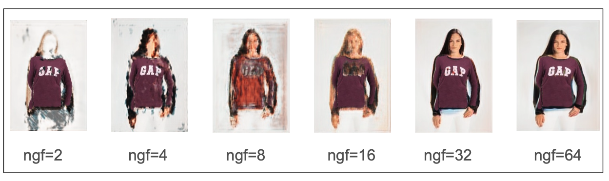

  
<h2>Warping Model Distillation</h2> 
I compressed the warping model, which originally had 29 million parameters, by reducing the number of channels within its convolution layers. 
Specifically, I modified the configuration from [64, 128, 256, 256, 256] to alternative combinations. 
Each number in this list represents the count of convolution filters utilized in constructing convolution layers for either a feature encoder
or a convolution layer within a refining pyramid feature network.
To provide clarity, when the list comprises 5 numbers, there are 5 feature encoders dedicated to both human image and clothing condition, respectively. Additionally, there are 5 convolution layers within a refining pyramid feature network. The various combinations are detailed in the table below.

    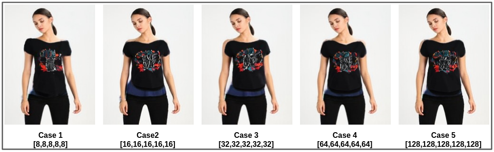

    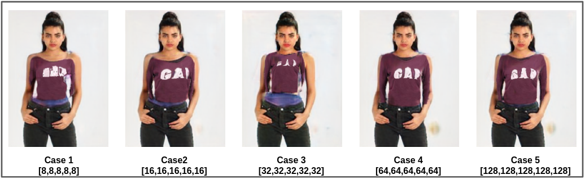

    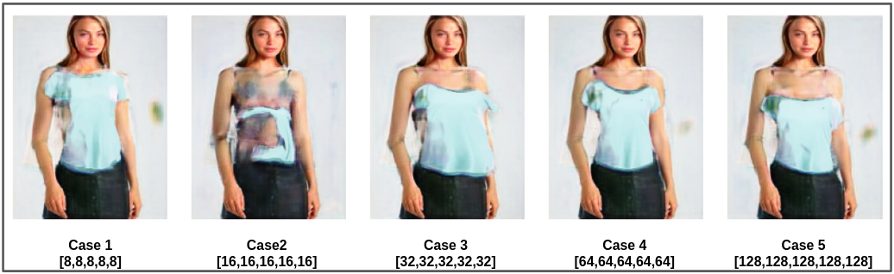

  
<h2>Distillation Performance</h2> 

    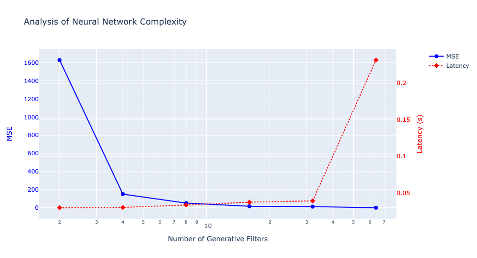

    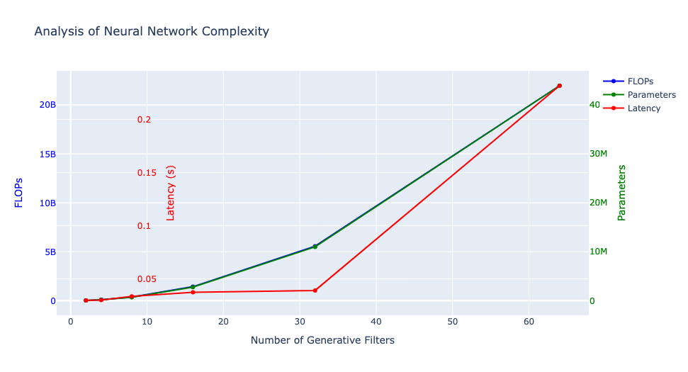

