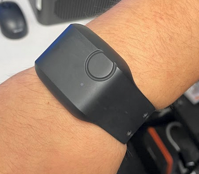
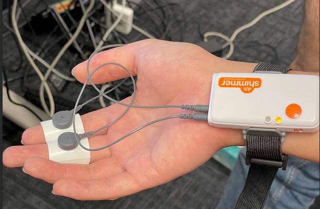
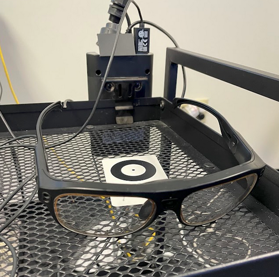
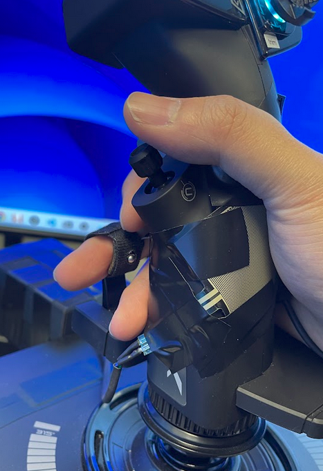
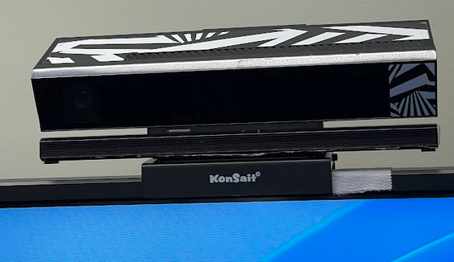
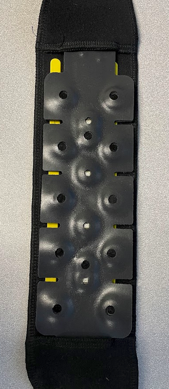
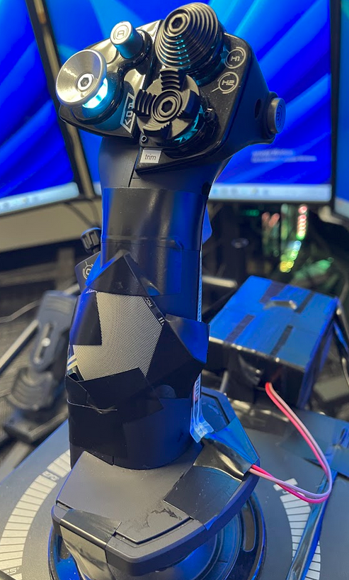

<h2>Motivation</h2> 
With the growing focus on urban air mobility, the development of next-generation air mobility systems has become a paramount area of research. This project is motivated by a semi-autonomous approach, where pilots remain within the aircraft, supported by advanced co-pilot systems to alleviate their workload during flight operations.
To enhance adaptive co-pilot systems, a key aspect is identifying instances when pilots experience high workloads. One way to assess pilots' mental and physical workloads during flight operations is to use various biometric data, such as heart rate, eye gaze, GSR, response time, etc., as inputs to a statistical estimator.
In this project, we are developing a machine learning model to estimate pilots' stress levels using physiological data measured during target flight operations.
  
<h2>Introduction</h2> 
Currently I am being involved in the development of a multimodal machine learning model aimed at estimating eVTOL (electric Vertical Take-off & Landing) aircraft pilot workload during various flight operations. As a member of a team consisting of researchers and engineers, we have been collecting multimodal biometric data (including Heart Rate, Eye Gaze, GSR, etc.) from pilots engaged in simulated flights with a VTOL aircraft. Our data collection process includes obtaining ground truth labels for pilot workload, gathered through pilots' self-evaluation using the NASA Task Load Index (TLX) questionnaire. Additionally, we are currently engaged in signal processing of the collected data and working on building a multimodal machine learning feature extraction system to estimate pilot workload. 
  
<h2>Simulated Flight</h2> 
One of our objectives is to measure pilots' mental and physical workload during flight maneuvers of VTOLs, the next generation of air mobility. Since this mode of air transportation has barely been commercialized, collecting biometric data while flying inside actual VTOLs is nearly impossible. Furthermore, this could pose a safety hazard, as physiological sensors attached to pilots can be sources of distraction during flights. For this reason, we collected data from pilots while they were flying inside a simulated environment, using Xplane12, a flight simulation game developed by Laminar Research.

    

  
<h2>Data & Sensors</h2> 
For a more accurate estimation of pilot workload, we chose to collect seven different modalities of physiological data. These include heart rate, galvanic skin response, eye gaze, response time, body pose, brain activity, and grip force. Our experiment set up is inspired by the work presented in <a href = "https://s2.smu.edu/~eclarson/pubs/2021_IMWUTCognitive_Load.pdf">Objective Measures of Cognitive Load Using Deep Multi-Modal Learning: A Use-Case in Aviation (2021)</a>.
<video controls="controls" width="400" height="800">
  <source src="../images/pilot_workload/experiment.MOV">
</video> 
 
<h3>Heart Rate</h3> 
We collected heart rate using a wristband heart rate monitor.

    

 
<h3>Galvanic Skin Response</h3> 
We collected galvanic skin response by wrapping electropads around the fingers of the participants. These electropads are connected to a wireless GSR sensor.

    

 
<h3>Eye Gaze</h3> 
We collected the participants' eye gaze using eye-tracking glasses.

    

 
<h3>Response Time</h3> 
We collected the participants' response time approximately every 15 seconds by activating a vibration motor attached to their collarbone. Participants were required to press a clicker whenever they felt the vibration.

    

 
<h3>Body Pose</h3> 
We collected upper body joint poses in 3D spatial coordinates (x, y, z) using an Xbox Kinect camera.

    

 
<h3>Brain Activity</h3> 
We collected brain activity using an fNIR (Functional near-infrared spectroscopy) sensor. This sensor emits non-invasive near-infrared light to estimate cortical hemodynamic activity.

    

 
<h3>Grip Force</h3> 
We collected the participants' grip force during the simulated flight using two individual force-sensing resistor strips attached to the joystick.

    

