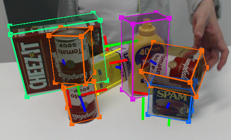

<h2>Motivation</h2> 
Real-time pose estimation for previously unseen objects presents a significant challenge in robotics and AR applications, particularly when training data is unavailable. Traditional approaches require extensive datasets for each target object, making them impractical for many real-world scenarios. Our project aimed to solve this limitation by developing a system that could accurately estimate 6-DoF poses for novel objects using synthetic data generation and efficient domain adaptation techniques.

<h2>Introduction</h2> 

    

This project tackled the challenge of estimating 6-DoF object poses in real-time without prior training data, a critical capability for robotic manipulation and augmented reality applications. Our objective was to develop a deployable pipeline that could accurately determine object positions and orientations while maintaining minimal computational overhead.

  
<h2>Methods</h2> 
Our approach centered on synthetic data generation to overcome the data scarcity challenge. Using platforms like Nvidia Isaac Sim and Blender, we created photorealistic training datasets that captured diverse object orientations and lighting conditions. The synthetic data pipeline incorporated domain randomization to enhance generalization capabilities. To bridge the synthetic-to-real domain gap, we implemented an adversarial domain adaptation strategy that fine-tuned the model on limited real-world data.

  
<h2>Results</h2> 
The implemented system achieved 85% pose accuracy on novel objects, matching the performance of traditional methods that require extensive training data. Through TensorRT optimization, we reduced both memory usage and inference latency by 60%, enabling deployment on resource-constrained edge devices. The domain adaptation approach successfully generalized from synthetic to real-world scenarios while maintaining robust performance across varying environmental conditions.
 
  
<h2>Discussion</h2> 
The project demonstrated the viability of zero-shot pose estimation through effective synthetic data utilization and domain adaptation. Key insights included the importance of physically accurate rendering for synthetic data generation and the effectiveness of progressive domain adaptation for handling the synthetic-to-real gap. The optimization process revealed crucial tradeoffs between model complexity and inference speed, leading to architectural decisions that balanced accuracy with real-time performance requirements.

  
<!-- 

    

 -->
